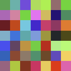

# bevy-canvas-2d

<p align="center">
  
</p>

[](https://crates.io/crates/bevy-canvas-2d)
[](https://docs.rs/bevy-canvas-2d)

[](https://github.com/FreddyWordingham/bevy-canvas-2d/actions)


A Bevy plugin that provides a very fast chunked 2D pixel canvas for pixel-art rendering, simulations, and procedural graphics, backed by CPU buffers and GPU Images.

## Overview

The canvas is split into a grid of chunks. Each chunk has:

- a CPU `Vec<u32>` storing packed **RGBA8** pixels (row-major), and
- a GPU `Image` updated via **partial texture uploads** using **dirty rectangles**.

Updates are submitted to the render world each frame and uploaded with `RenderQueue::write_texture`, keeping writes efficient even when you only change small parts of the canvas.

## Features

- Message-based draw API:
  - `ClearCanvas`
  - `DrawPixel`
  - `DrawPixels`
  - `DrawRect` (row-major)
  - `DrawSpan` (row-major stream)
- **Chunked textures** (helps keep uploads small and predictable)
- **Dirty-rect tracking per chunk** (uploads only changed regions)
- **Toroidal wrap** for draw operations that exceed canvas bounds
- **Bottom-left origin** canvas coordinates

## Use cases

- Cellular automata and grid-based simulations
- Pixel-art tools and editors
- Procedural texture generation
- Visual debugging buffers
- High-frequency per-pixel updates in Bevy

## Compatibility

| Bevy | Canvas 2D |
| ---- | --------- |
| 0.17 | 0.1       |

## Installation

```toml
[dependencies]
bevy-canvas-2d = "0.1"
```

## Quick Start

```rust
use bevy::prelude::*;
use bevy_canvas_2d::prelude::*;

fn main() {
    App::new()
        .add_plugins(DefaultPlugins)
        .add_plugins(CanvasPlugin {
            config: CanvasConfig::default(),
        })
        .add_systems(Startup, spawn_camera)
        .run();
}

fn spawn_camera(mut commands: Commands) {
    commands.spawn((
        Camera2d,
        Camera {
            clear_color: ClearColorConfig::Custom(Color::BLACK),
            ..default()
        },
    ));
}
```

## Canvas Configuration

Configure the canvas via the `CanvasConfig` struct passed to the `CanvasPlugin`.

```rust
use bevy::{math::U8Vec2, prelude::*};
use bevy_canvas_2d::prelude::*;


App::new()
    .add_plugins(DefaultPlugins)
    .add_plugins(CanvasPlugin {
        config: CanvasConfig {
            canvas_z_index: 0.0,
            clear_colour: 0xFFFFFFFF,
            canvas_size: UVec2::new(512, 512),
            num_chunks: U8Vec2::new(4, 4),
            ..default()
        },
    })
    .run();
```

| Parameter        | Description                                                                                    |
| ---------------- | ---------------------------------------------------------------------------------------------- |
| `canvas_z_index` | Z index of the canvas images                                                                   |
| `clear_colour`   | Default clear colour (packed RGBA8 `u32`)                                                      |
| `canvas_size`    | Size of the canvas in pixels                                                                   |
| `num_chunks`     | Number of chunks in X and Y. Note that `canvas_size` must be exactly divisible by `num_chunks` |

## Drawing API

All drawing is done by sending messages that are consumed each update.
Note that all writes overwrite existing pixels; there is no blending.

### Packing Colours

Colours are packed as little-endian RGBA8 u32 for efficiency.

```rust
use bevy_canvas_2d::prelude::*;

let white = pack_rgba8([255, 255, 255, 255]);
let red   = pack_rgba8([255,   0,   0, 255]);
```

### Clear Canvas

```rust
use bevy::prelude::*;
use bevy_canvas_2d::prelude::*;

fn clear(mut msg: MessageWriter<ClearCanvas>) {
    let colour = pack_rgba8([10, 20, 30, 255]);

    msg.write(ClearCanvas { rgba_u32: colour });
}
```

### Draw Individual Pixels

```rust
use bevy::prelude::*;
use bevy_canvas_2d::prelude::*;

fn draw(mut msg: MessageWriter<DrawPixel>) {
    let colour = pack_rgba8([255, 0, 0, 255]);

    msg.write(DrawPixel {
        pos: UVec2::new(12, 34),
        rgba_u32: colour,
    });
}
```

### Draw Multiple Independent Pixels

```rust
use bevy::prelude::*;
use bevy_canvas_2d::prelude::*;

fn draw(mut msg: MessageWriter<DrawPixels>) {
    let positions = vec![UVec2::new(1, 1), UVec2::new(2, 2), UVec2::new(3, 3)];
    let rgba_u32 = vec![
        pack_rgba8([255, 0, 0, 255]),
        pack_rgba8([0, 255, 0, 255]),
        pack_rgba8([0, 0, 255, 255]),
    ];

    msg.write(DrawPixels { positions, rgba_u32 });
}
```

### Draw Rectangles (Row-Major)

`DrawRect` draws a rectangle of size starting at start. The source pixels are row-major: $\text{index} = y \times \text{width} + x$.

If the rectangle exceeds the canvas bounds, it will wrap around toroidally.

```rust
use bevy::prelude::*;
use bevy_canvas_2d::prelude::*;

fn draw(mut msg: MessageWriter<DrawRect>) {
    let width = 32;
    let height = 16;
    let colour = pack_rgba8([200, 60, 80, 255]);

    msg.write(DrawRect {
        start: UVec2::new(500, 500),
        size: UVec2::new(width, height),
        rgba_u32: vec![colour; (width * height) as usize],
    });
}
```

### Draw Spans (Row-Major Stream)

`DrawSpan` writes a contiguous stream of pixels starting at start.
It advances across X, then moves up a row, wrapping at edges.

If the wrap exceeds the horizontal bound, then the pixels will wrap to the next row up.
If the wrap exceeds the vertical bound, then the pixels will wrap back to the bottom of the canvas.

```rust
use bevy::prelude::*;
use bevy_canvas_2d::prelude::*;

fn draw(mut msg: MessageWriter<DrawSpan>) {
    let colour = pack_rgba8([255, 255, 0, 255]);

    msg.write(DrawSpan {
        start: UVec2::new(30, 40),
        rgba_u32: vec![colour; 128],
    });
}
```

## Examples

See the `examples/` folder for example Bevy apps using the canvas.

| Example      | Description                                                         | Run Command                        |
| ------------ | ------------------------------------------------------------------- | ---------------------------------- |
| simple       | Basic canvas setup. (No interaction)                                | `cargo run --example simple`       |
| clear_colour | Clears the canvas to random colours each frame.                     | `cargo run --example clear_colour` |
| draw_pixel   | Draws random individual pixels each frame.                          | `cargo run --example draw_pixel`   |
| draw_pixels  | Draws random multiple independent pixels each frame.                | `cargo run --example draw_pixels`  |
| draw_rect    | Draws rectangles of random positions, sizes and colours each frame. | `cargo run --example draw_rect`    |
| draw_span    | Fills the canvas with random spans each frame.                      | `cargo run --example draw_span`    |

## Details

### Coordinate system

Canvas coordinates are bottom-left origin.
Internally this is achieved by flipping the chunk sprites on Y (scale.y = -1.0).

All draw operations wrap toroidally within the canvas bounds.

### Performance notes

Dirty tracking is per chunk and unions all writes into a single axis-aligned dirty rectangle.
Smaller chunks reduce upload size but increase sprite count; larger chunks reduce sprite count but increase upload cost.

GPU uploads are done via RenderQueue::write_texture.

Upload rows are padded in X to satisfy the WGPU constraint that bytes_per_row is 256-byte aligned.
For RGBA8, that’s 64 pixels alignment.
